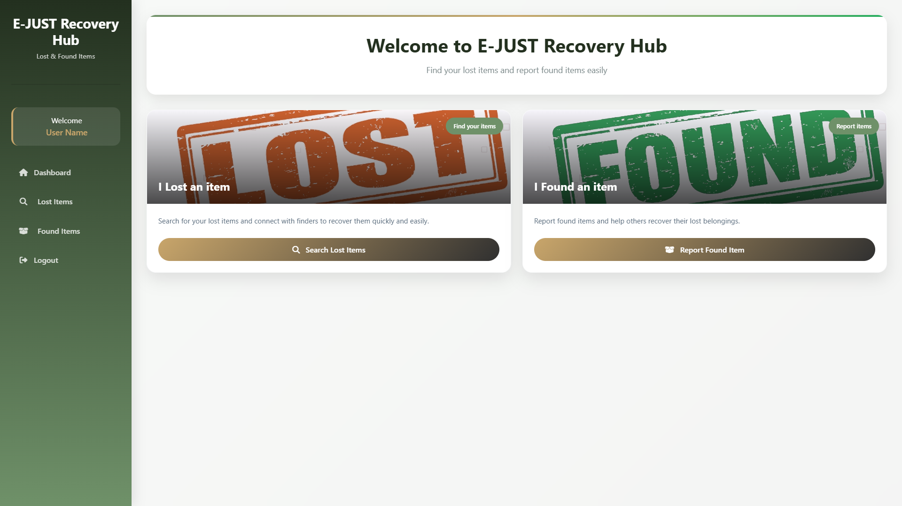
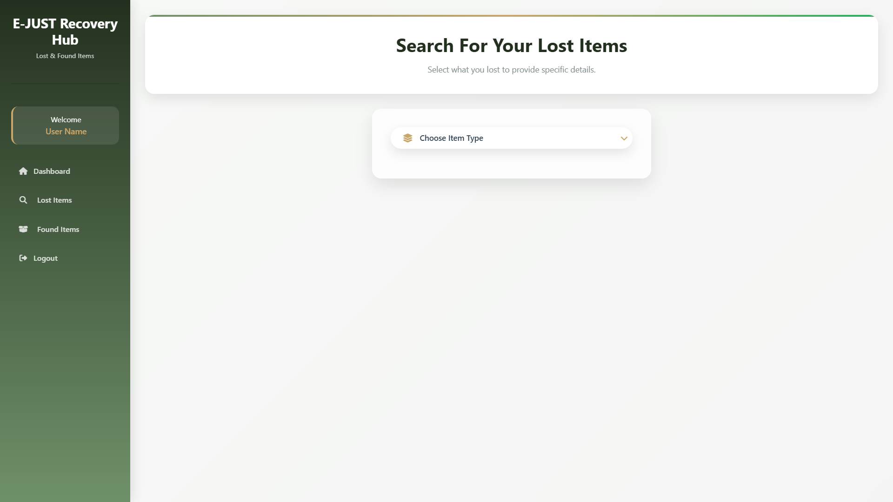
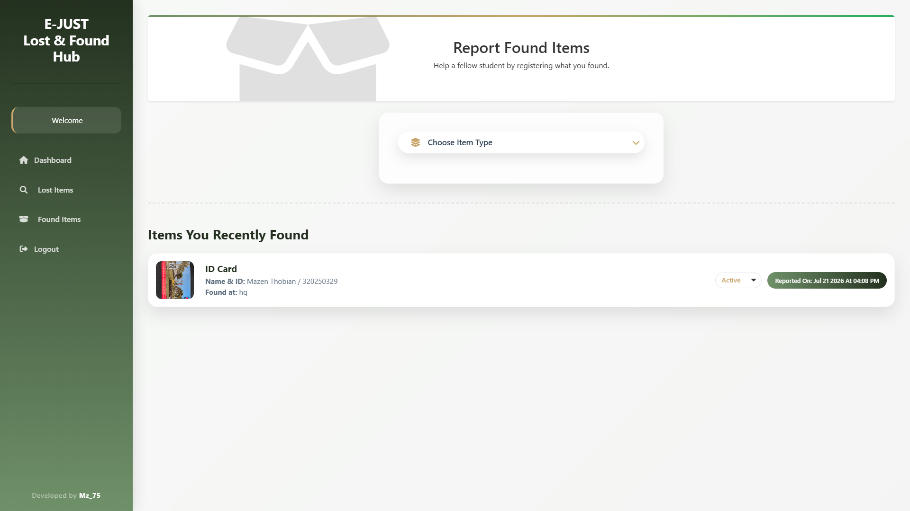

# E-JUST Lost & Found Hub
> A modern web application designed to help university students quickly report, search for, and reunite with their lost belongings.

## 📖 The Story Behind the Code
Losing an ID card, wallet, or phone on campus is a nightmare, and relying on chaotic Facebook or WhatsApp groups rarely works. I originally built a solution for this as a local Java Windows application relying on basic `.dat` files for storage. However, to truly solve the problem at scale for the campus, it needed to be accessible to everyone, from anywhere.

This project represents the complete architectural migration of that concept into a secure, modern **ASP.NET MVC** web application. It bridges the gap between a real-world campus problem and modern web security, focusing heavily on protecting student privacy while delivering a clean, intuitive user experience.

---

## ✨ Key Features

* **Privacy-First Contact System:** Scrapers and bots are a real threat. To protect student phone numbers, the raw HTML never exposes contact info. Users are limited by a strict, cookie-based rate limiter (maximum 3 contact reveals per day) to prevent data harvesting.
* **Smart Database Architecture:** Utilizes Entity Framework with a **Table-Per-Type (TPT)** polymorphic design. Instead of a messy single table, specific categories (Electronic Devices, ID Cards, Wallets, Jewelry, Notebooks) have their own strict relational tables and data fields.
* **Hardened Security:** Built-in defenses against Cross-Site Request Forgery (CSRF) and Insecure Direct Object Reference (IDOR) ensure that only the original finder can update an item's status to "Returned."
* **Glassmorphism UI:** A highly responsive, modern interface built with custom modular CSS architecture and asynchronous SweetAlert2 popups for seamless, non-blocking user interactions.

---

## 🛠️ Built With

* **Framework:** ASP.NET MVC
* **Database:** Microsoft SQL Server & Entity Framework
* **Frontend:** HTML5, Custom CSS, JavaScript
* **UI Utilities:** FontAwesome, SweetAlert2

---

## 📸 Screenshots

